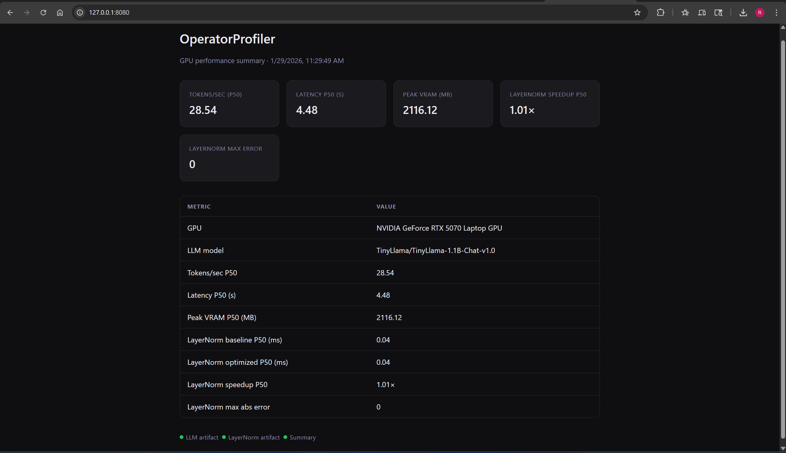

# OperatorProfiler

<<<<<<< HEAD
GPU operator performance : LLM inference benchmark, LayerNorm (Triton), and a summary dashboard.
=======
**End-to-end GPU operator performance lab: baseline inference → profiling mindset → kernel optimization → reproducible metrics and dashboard.**
>>>>>>> e25ef3a (Update README, add dashboard screenshot)

A self-contained performance project demonstrating disciplined measurement, operator-level optimization (LayerNorm with Triton), and product-style packaging (JSON/CSV artifacts, static dashboard) — aligned with GPU software engineering and AI-on-GPU workflows.

---

## Table of Contents

- [Aim & Objective](#aim--objective)
- [Why This Project (AMD Relevance)](#why-this-project-amd-relevance)
- [Achievements & Deliverables](#achievements--deliverables)
- [Results](#results)
- [Dashboard Screenshot](#dashboard-screenshot)
- [Repository Structure](#repository-structure)
- [Quick Start](#quick-start)
- [Technical Highlights](#technical-highlights)
- [References](#references)

---

## Aim & Objective

**Aim:** Demonstrate a complete GPU performance workflow: establish baseline metrics, identify operator hotspots, implement and validate an optimized kernel, and package results for clear, reproducible reporting.

**Objectives:**

1. **Baseline LLM inference** — Measure end-to-end inference (tokens/sec, latency, peak VRAM) with controlled methodology (warmup, synchronization, repeated runs, P50/P95).
2. **Operator-level optimization** — Implement a custom LayerNorm kernel (Triton), validate correctness against PyTorch, and report delta metrics (speedup, max error).
3. **Reproducibility & packaging** — Export metrics to JSON/CSV, consolidate into a single summary, and expose them via a static dashboard for reviewers.

---

## Why This Project (AMD Relevance)

- **GPU performance at operator level** — Focus on GEMM, attention, and normalization patterns relevant to AI workloads on GPUs (including AMD ROCm targets).
- **Rigorous measurement** — Warmup, GPU synchronization, P50/P95 latency, and delta metrics (baseline vs optimized) instead of one-off numbers.
- **Portable optimization approach** — Triton-based kernel as a portable optimization path; methodology transfers to ROCm with a runbook (see [References](#references)).
- **Product-style delivery** — One-command runs, stable artifact names (`summary.json`, `summary.csv`), and a recruiter-facing dashboard so outcomes are easy to review.

---

## Achievements & Deliverables

| Deliverable | Description |
|-------------|-------------|
| **LLM inference benchmark** | End-to-end TinyLlama (1B-class) benchmark with tokens/sec, latency, peak VRAM; chat-template–aware; outputs `artifacts/llm.json`. |
| **LayerNorm kernel** | Triton LayerNorm forward kernel; PyTorch fallback on Windows (Triton not on PyPI); correctness check vs `F.layer_norm`. |
| **LayerNorm benchmark** | Baseline (PyTorch) vs optimized (Triton) timing with CUDA events; P50/P95 and speedup; outputs `artifacts/layernorm.json`. |
| **Summary pipeline** | Single script reading all artifacts → `artifacts/summary.json` and `artifacts/summary.csv` as the source of truth for resume/metrics. |
| **Static dashboard** | HTML/CSS/JS dashboard (no npm); table + highlight cards; deployable to Vercel for a public URL. |
| **Reproducibility** | Artifacts drive the dashboard; re-run benchmarks and refresh `summary.json` for updated numbers. |

---

## Results

Metrics below are from a single run (see `artifacts/summary.json`). Re-run the benchmarks to reproduce or update.

### LLM Inference (TinyLlama 1.1B-Chat, fp16, 128 max new tokens, 5 repeats)

| Metric | Value |
|--------|--------|
| **Model** | TinyLlama/TinyLlama-1.1B-Chat-v1.0 |
| **GPU** | NVIDIA GeForce RTX 5070 Laptop GPU |
| **Tokens/sec (P50)** | 28.54 |
| **Latency P50 (s)** | 4.48 |
| **Peak VRAM P50 (MB)** | 2116.12 |

### LayerNorm (shape `[4, 512, 1024]`, 100 iters, 20 warmup)

| Metric | Value |
|--------|--------|
| **Baseline P50 (ms)** | 0.036 |
| **Baseline P95 (ms)** | 0.050 |
| **Optimized P50 (ms)** | 0.036 |
| **Optimized P95 (ms)** | 0.050 |
| **Speedup P50** | 1.01× |
| **Speedup P95** | 1.00× |
| **Max abs error vs PyTorch** | 0.0 |

*On Windows, Triton is not available on PyPI; the “optimized” path uses the same PyTorch implementation, hence speedup ≈ 1×. On Linux, `pip install triton` enables the Triton kernel for measurable speedup.*

---

## Dashboard Screenshot

*Add your dashboard screenshot here (e.g. after deploying to Vercel or running the dashboard locally).*

1. Save your screenshot as `report/dashboard.png`.
2. The image will appear below once the file is added.

<!-- Paste your screenshot in report/dashboard.png and uncomment the next line -->
<!--  -->

**Placeholder:** After you add `report/dashboard.png`, uncomment the line above in this README so the image displays.

---

## Repository Structure

```
operator-profiler/
├── bench/                 # Benchmark and summarization scripts
│   ├── llm_infer_bench.py # LLM inference → artifacts/llm.json
│   ├── layernorm_bench.py # LayerNorm baseline vs Triton → artifacts/layernorm.json
│   ├── summarize.py      # Consolidate artifacts → summary.json, summary.csv
│   ├── measure.py        # Timing (CUDA events, P50/P95), write_json, device_info
│   └── utils.py          # Logging, run_main, require_cuda, validators
├── kernels/               # Optimized operator implementations
│   └── triton_layernorm.py
├── dashboard/             # Static dashboard (HTML/CSS/JS, no npm)
│   ├── index.html
│   ├── style.css
│   ├── app.js
│   └── summary.json      # Copy of summary for dashboard; update from artifacts/
├── report/                # Screenshots and short narrative (e.g. dashboard.png)
├── artifacts/             # Generated JSON/CSV (gitignored; re-run to reproduce)
├── requirements.txt
└── README.md
```

---

## Quick Start

**Environment:** Python 3.10+, CUDA-enabled PyTorch, conda env `ml` (or install from `requirements.txt`).

```bash
# From repo root
conda activate ml

# 1. LLM inference benchmark
python -m bench.llm_infer_bench --model TinyLlama/TinyLlama-1.1B-Chat-v1.0 --max_new_tokens 128 --out artifacts/llm.json

# 2. LayerNorm benchmark
python -m bench.layernorm_bench --out artifacts/layernorm.json

# 3. Summarize all artifacts
python -m bench.summarize --out-dir artifacts

# 4. Update dashboard data and run locally
copy artifacts\summary.json dashboard\summary.json
cd dashboard && python -m http.server 8080 --bind 127.0.0.1
# Open http://127.0.0.1:8080
```

**Deploy dashboard to Vercel:** Set root directory to `dashboard`; no build step. See `dashboard/README.md`.

---

## Technical Highlights

- **Measurement hygiene:** Warmup runs, GPU synchronization before/after timing, P50/P95 over multiple iterations (not single-run).
- **Correctness:** LayerNorm kernel validated with max absolute error vs PyTorch `F.layer_norm`.
- **Single source of truth:** All benchmarks write JSON artifacts; `summarize.py` produces `summary.json` / `summary.csv` for resume and dashboard.
- **Portability:** Triton kernel runs on Linux; PyTorch fallback on Windows so the benchmark and dashboard still run.

---

## References

- Lab guide and runbook: `OperatorProfiler_Lab_Guide.docx` (setup, measurement hygiene, ROCm context).
- Triton: [triton-lang.org](https://triton-lang.org) (Linux; LayerNorm tutorial).
- Upload to GitHub: [GITHUB.md](GITHUB.md).

---

*OperatorProfiler — GPU operator performance lab for reproducible metrics and operator-level optimization.*
